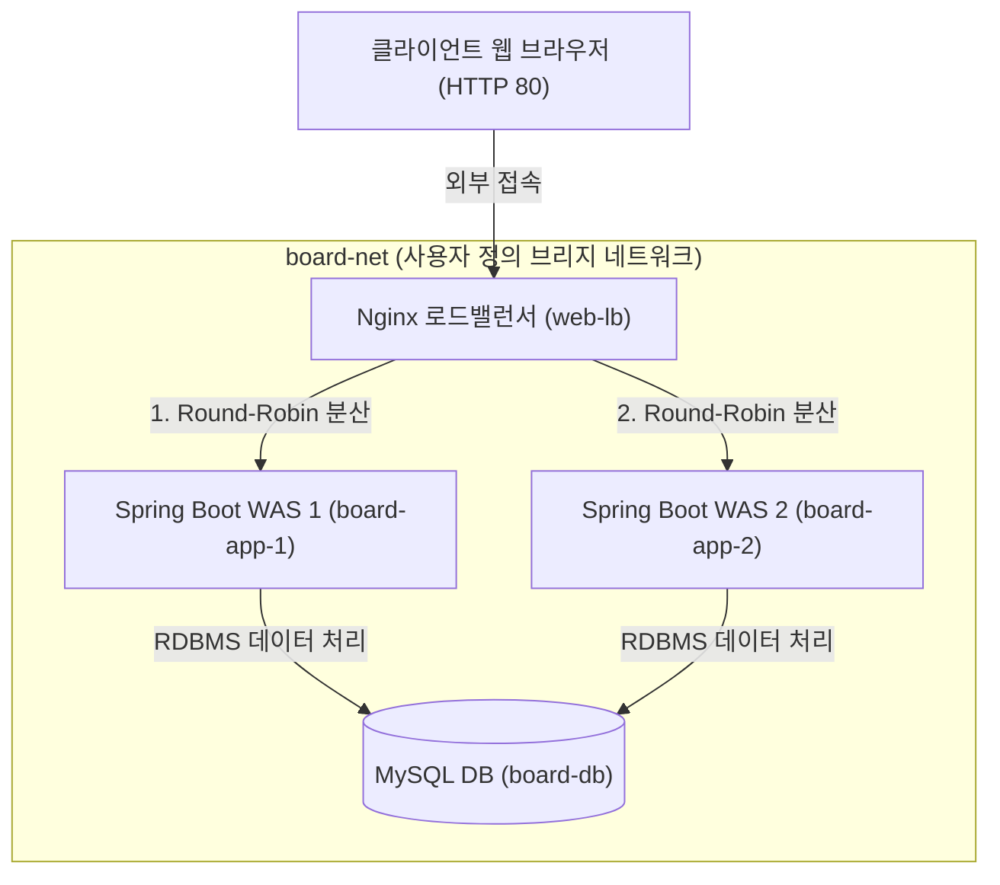
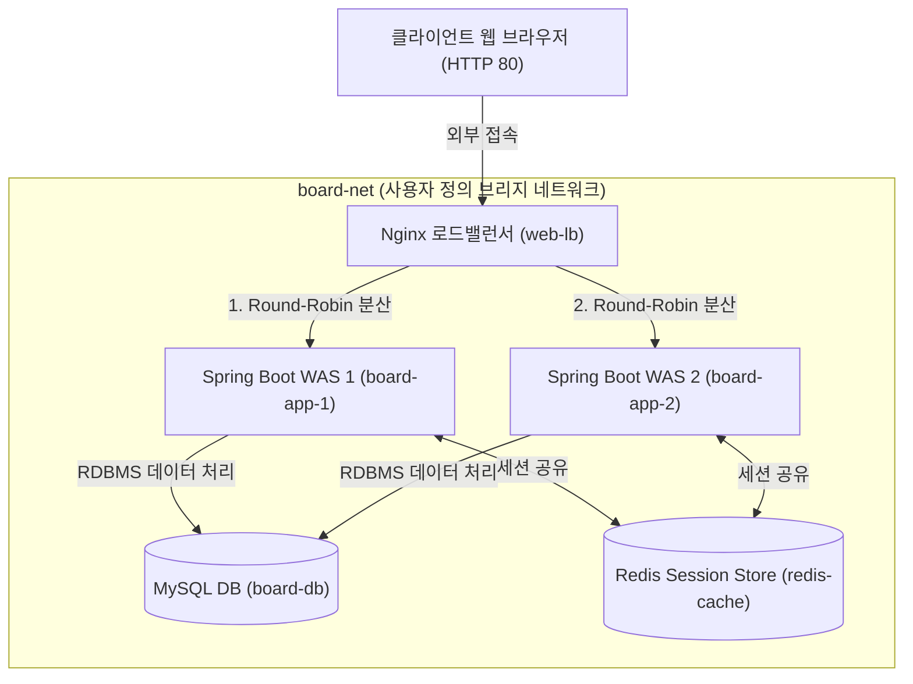

# Docker Compose 기반 다중 컨테이너 오케스트레이션

## 학습 목표
- Docker Compose의 선언적 오케스트레이션 개념 및 작동 메커니즘을 이해함.
- docker-compose.yml 파일의 4대 요소 및 핵심 지시어를 올바르게 정의할 수 있음.
- 다중 컨테이너 간의 네트워크 격리, 데이터 영속화 및 구동 의존성을 제어할 수 있음.
- Docker Compose CLI 명령어를 활용하여 서비스 전체 라이프사이클을 통합 모니터링 및 운용할 수 있음.
- Nginx 로드밸런싱, Spring Boot 이중화, MySQL, Redis 기반 고가용성 시스템을 구축하고 세션 클러스터링을 검증할 수 있음.

## 목차
- [1. Docker Compose 정의 및 아키텍처](#1-docker-compose-정의-및-아키텍처)
    - [1.1 Docker Compose 도입 배경 및 필요성](#11-docker-compose-도입-배경-및-필요성)
    - [1.2 Docker Compose 동작 메커니즘](#12-docker-compose-동작-메커니즘)
    - [1.3 단일 컨테이너 실행 방식과 Compose 선언적 방식 비교](#13-단일-컨테이너-실행-방식과-compose-선언적-방식-비교)
- [2. docker-compose.yml 표준 규격 및 주요 지시어](#2-docker-composeyml-표준-규격-및-주요-지시어)
    - [2.1 YAML 파일 기본 작성 규칙](#21-yaml-파일-기본-작성-규칙)
    - [2.2 Compose 파일 구성 요소 및 최상위 블록](#22-compose-파일-구성-요소-및-최상위-블록)
    - [2.3 서비스 정의 및 주요 지시어 (services)](#23-서비스-정의-및-주요-지시어-services)
    - [2.4 네트워크 구성 및 포트 바인딩 (networks)](#24-네트워크-구성-및-포트-바인딩-networks)
    - [2.5 볼륨 구성 및 데이터 영속화 (volumes)](#25-볼륨-구성-및-데이터-영속화-volumes)
    - [2.6 구성 파일 및 비밀 정보 관리 (configs / secrets)](#26-구성-파일-및-비밀-정보-관리-configs--secrets)
- [3. Docker Compose CLI 운용 및 오케스트레이션 제어](#3-docker-compose-cli-운용-및-오케스트레이션-제어)
    - [3.1 서비스 제어 및 생성 파기](#31-서비스-제어-및-생성-파기)
    - [3.2 서비스 상태 검증 및 로그 모니터링](#32-서비스-상태-검증-및-로그-모니터링)
    - [3.3 컨테이너 내부 명령어 실행 및 리소스 정제](#33-컨테이너-내부-명령어-실행-및-리소스-정제)
- [4. spring-board, Nginx, MySQL, Redis 기반 다중 컨테이너 구축 실습](#4-spring-board-nginx-mysql-redis-기반-다중-컨테이너-구축-실습)
    - [4.1 아키텍처 토폴로지 및 실습 구성요소](#41-아키텍처-토폴로지-및-실습-구성요소)
    - [4.2 애플리케이션 및 인프라 명세 작성](#42-애플리케이션-및-인프라-명세-작성)
    - [4.3 로드밸런싱 동작 및 세션 불일치 테스트](#43-로드밸런싱-동작-및-세션-불일치-테스트)
    - [4.4 Redis 기반 세션 공유 확장](#44-redis-기반-세션-공유-확장)
    - [4.5 동적 컨테이너 스케일링 확장](#45-동적-컨테이너-스케일링-확장)

---

# 1. Docker Compose 정의 및 아키텍처

## 1.1 Docker Compose 도입 배경 및 필요성

### 1.1.1 수동 실행 방식의 한계
- 현대 엔터프라이즈 애플리케이션은 단일 컨테이너로 동작하지 않고 Web Application Server, Database, Cache, Message Broker 등 복수의 독립된 컨테이너가 상호 연동하여 작동함.
- 단일 `docker run` 명령어 집합으로 복수 컨테이너를 수동 생성할 경우, 네트워크 생성, 포트 바인딩, 환경 변수 주입, 볼륨 마운트 및 구동 순서 지정을 매번 명령줄에서 복잡하게 수행해야 함.

### 1.1.2 환경 재현성 결여 및 운용 파편화
- 수동 쉘 스크립트에 의존한 컨테이너 구동은 인프라 구성 정보의 버전 관리를 어렵게 만들며, 개발자 개개인의 실행 옵션 오차로 인해 개발, 검증, 운영 환경 간 불일치가 발생함.

### 1.1.3 선언적 인프라 구성(IaC)으로의 전환
- Docker Compose는 다중 컨테이너로 구성된 전체 애플리케이션 시스템의 구성을 단일 YAML [^1] 파일에 선언적으로 작성하여 관리함.
- 이를 통해 전체 서비스를 단 한 줄의 명령어로 일괄 구동, 중지, 정제할 수 있는 선언적 오케스트레이션 환경을 제공함.

## 1.2 Docker Compose 동작 메커니즘

### 1.2.1 Compose 파일 해석 및 엔진 전달
- Docker Compose CLI는 지정된 `docker-compose.yml` 설정 파일을 읽어 구문 규격을 검증한 후, 도커 데몬(Docker Daemon)의 REST API [^2]를 호출하여 컨테이너, 네트워크, 볼륨 등의 리소스를 일괄 요청함.

### 1.2.2 독립된 프로젝트 격리 단위
- Docker Compose는 기본적으로 파일이 위치한 디렉터리 명칭을 프로젝트 이름으로 사용하여 리소스를 격리함.
- 생성되는 컨테이너, 네트워크, 볼륨에는 `프로젝트명_서비스명_순번` 형태의 표준 네이밍 프리픽스가 자동 부여되어 타 프로젝트와의 이름 충돌을 방지함.

### 1.2.3 사용자 정의 전용 브리지 네트워크 자동 생성
- Compose 실행 시 명시적인 네트워크 지시어가 없더라도 `프로젝트명_default` 이름의 독자적인 Bridge 네트워크가 자동 생성됨.
- 동일 Compose 파일 내에 선언된 서비스 컨테이너들은 이 네트워크에 함께 참여하여, 서비스 명칭을 호스트 이름으로 사용하는 도커 내장 DNS 서비스 디스커버리를 통해 IP 변경과 무관하게 상호 통신을 수행함.

## 1.3 단일 컨테이너 실행 방식과 Compose 선언적 방식 비교

### 1.3.1 쉘 스크립트 기반 수동 실행 방식
- 각 리소스를 일일이 개별 명령어로 실행해야 함
```bash
# 1. 사용자 정의 네트워크 및 볼륨 생성
docker network create board-net
docker volume create board-db-data

# 2. 데이터베이스 컨테이너 구동
docker run -d --name board-db \
  --network board-net \
  -p 3306:3306 \
  -e MYSQL_DATABASE=board_db \
  -e MYSQL_USER=board-app \
  -e MYSQL_PASSWORD=Board123! \
  -e MYSQL_ROOT_PASSWORD=rootpass \
  -v board-db-data:/var/lib/mysql \
  mysql:9.7

# 3. spring-board 웹 애플리케이션 컨테이너 구동
MSYS_NO_PATHCONV=1 docker run -d --name board-app \
  -p 80:8080 \
  --network board-net \
  -e SPRING_DATASOURCE_URL="jdbc:mysql://board-db:3306/board_db?useSSL=false&allowPublicKeyRetrieval=true" \
  -e SPRING_DATASOURCE_USERNAME=board-app \
  -e SPRING_DATASOURCE_PASSWORD=Board123! \
  -e SPRING_SQL_INIT_MODE=always \
  -v "${PWD}/uploads:/app/uploads" \
  -v "${PWD}/logs:/app/logs" \
  kilyong/spring-board:1.0
```

### 1.3.2 Docker Compose 선언적 실행 방식
- 단일 파일에 전체 구성을 선언하여 일괄 구동함
```yaml
networks:
  board-net:
    driver: bridge

volumes:
  board-db-data:
  
services:
  board-db:
    image: mysql:9.7
    container_name: board-db
    ports:
      - "3306:3306"
    networks:
      - board-net
    environment:
      MYSQL_DATABASE: board_db
      MYSQL_USER: board-app
      MYSQL_PASSWORD: Board123!
      MYSQL_ROOT_PASSWORD: rootpass
    volumes:
      - board-db-data:/var/lib/mysql

  board-app:
    image: kilyong/spring-board:1.0
    container_name: board-app
    ports:
      - "80:8080"
    networks:
      - board-net
    environment:
      SPRING_DATASOURCE_URL: jdbc:mysql://board-db:3306/board_db?useSSL=false&allowPublicKeyRetrieval=true
      SPRING_DATASOURCE_USERNAME: board-app
      SPRING_DATASOURCE_PASSWORD: Board123!
      SPRING_SQL_INIT_MODE: always
    volumes:
      - ./uploads:/app/uploads
      - ./logs:/app/logs

```

### 1.3.3 인프라 관리 효율성 비교
- 수동 실행 방식은 긴 명령어를 순서대로 실행하고 실패 시 개별 정제 작업을 수행해야 하지만, Compose 선언 방식은 `docker compose up -d` 명령어 하나로 전체 인프라를 일괄 구축하고 `docker compose down` 명령어로 깔끔하게 파기함.

---

# 2. docker-compose.yml 표준 규격 및 주요 지시어

## 2.1 YAML 파일 기본 작성 규칙
- Docker Compose 파일은 YAML 파일을 사용하여 다중 컨테이너 애플리케이션의 인프라 구성을 선언적으로 작성함.
- YAML 파일 기본 문법 작성 규칙
    - 들여쓰기(Indentation): 스페이스 1칸 이상이면 문법적으로 모두 허용되나, 계층 깊이에 따른 가독성을 고려해 관례적으로 스페이스 2칸을 권장하며 동일 문서 내 들여쓰기에 사용되는 스페이스는 일관되게 맞추어야 함. Tab 문자 사용은 안됨 (단, IDE 에디터의 탭 키 입력 시 자동 공백 변환 기능은 사용 가능).
    - 대소문자 구분(Case Sensitivity): 모든 키(Key)와 값(Value)은 대소문자를 엄격하게 구분함.
    - Key-Value 구분: 콜론(`:`) 기호 바로 뒤에는 반드시 띄어쓰기(Space 1칸)를 작성해야 함 (예: `image: mysql:9.7`).
    - 리스트 표기: 하이픈(`-`)과 띄어쓰기 1칸을 조합하여 배열(List) 항목을 줄바꿈으로 기술하거나, 대괄호 `[...]` 와 쉼표를 조합하여 실제 한 줄 단축 인라인 표기(Flow Style)로 작성함 (예: `depends_on: [board-db, redis-cache]`).
    - 리스트 내 객체 표기 (Object Array): 배열 항목이 여러 속성(`source`, `target` 등)을 가지는 1개의 객체인 경우, 객체의 시작을 알리는 첫 번째 속성에만 하이픈(`-`)을 붙이고 동일 객체의 하위 속성들(`target:`, `mode:` 등)은 하이픈 없이 들여쓰기로 기술함.
      ```yaml
      volumes:
        - ./uploads:/app/uploads
        - ./logs:/app/logs
      ```
    - 주석: `#` 기호를 사용하여 독립된 라인 주석이나 코드 우측 인라인 주석을 작성함.
      ```yaml
      # Bind Mounts 지정
      volumes:
        - ./uploads:/app/uploads # 파일 업로드 폴더
        - ./logs:/app/logs # 로그파일 저장 폴더
      ```

## 2.2 Compose 파일 구성 요소 및 최상위 블록
- 최상위 4대 구성 요소
    - `services`: 구동할 개별 애플리케이션 컨테이너 정의.
    - `networks`: 컨테이너 간 상호 통신을 위한 사용자 정의 브리지 네트워크 정의.
    - `volumes`: 컨테이너 데이터 영속성을 위한 Named Volume 정의.
    - `configs` / `secrets`: 애플리케이션 구성 파일 및 민감 보안 정보 정의.

## 2.3 서비스 정의 및 주요 지시어 (`services`)
- `services:` 키 하위에 각 애플리케이션 서비스 개체(예: `board-db`, `board-app`)를 정의할 때 설정하는 주요 속성 지시어.

### 2.3.1 이미지 및 빌드 지시어 (`image`, `build`)
- `image`: 중앙 또는 사설 이미지 레지스트리에서 가져올 컨테이너 이미지 태그 명시. 예: `image: mysql:9.7`
- `build`: 소스코드 내 Dockerfile을 직접 빌드하여 컨테이너로 구동할 때 사용.
    - `context`: 빌드 컨텍스트 디렉터리 경로 지정.
    - `dockerfile`: 사용할 Dockerfile 파일명 지정.
    - `args`: 빌드 타임 환경 변수 전달.

- 작성 예시
  ```yaml
  # 다중 컨테이너 서비스 명세
  services:
    # 게시판 웹 애플리케이션 서비스
    board-app:
      build:
        context: .
        dockerfile: Dockerfile
        args:
          PROFILE: dev

    # MySQL 데이터베이스 서비스
    board-db:
      image: mysql:9.7
  ```

### 2.3.2 컨테이너 식별 및 재시작 정책 (`container_name`, `restart`)
- `container_name`: 고정된 컨테이너 명칭을 직접 지정함. 미지정 시 `프로젝트명-서비스명-1` 형태의 자동 이름이 부여됨.
- `restart`: 컨테이너 종료 또는 장애 발생 시 자동 재시작 정책 설정 (모든 재시작 정책은 도커 데몬의 공통 지수 백오프 [^2] (Backoff) 알고리즘을 사용하여 연속 실패 시 재시작 지연 시간이 1초, 2초, 4초, 8초... 형태로 점진적으로 증가함. 최대 약 1분 간격으로 계속 재시도를 유지).
    - `no`: 자동 재시작하지 않음 (기본값).
    - `always`: 수동 중지되지 않는 한 무한 재시작을 시도함.
    - `on-failure[:max-retries]`: 비정상 종료(Exit Code 0이 아님) 시에만 재시작하며, `on-failure:5`와 같이 최대 재시작 시도 횟수를 제한할 수 있음.
    - `unless-stopped`: 사용자가 수동으로 중지하기 전까지 도커 데몬 및 시스템 재부팅 시에도 항상 재시작함.
- 작성 예시
  ```yaml
  services:
    # MySQL 데이터베이스 서비스
    board-db:
      image: mysql:9.7
      container_name: board-db
      restart: always
  ```

### 2.3.3 환경 변수 주입 (`environment`, `env_file`)
- `environment`: 컨테이너 내부 런타임 환경 변수를 Key-Value 형태로 직접 주입함.
- `env_file`: 외부 `.env` 파일에 선언된 환경 변수를 컨테이너로 일괄 읽어와 주입함. 소스코드(YAML)와 개별 런타임 환경 설정(DB URL, 포트, 구동 프로필 등)을 깔끔히 분리하여 관리할 때 활용.
- 환경 변수 우선순위 계층: CLI `-e` 옵션(1위) > YAML `environment:` 블록(2위) > `env_file:` 파일(3위) > Dockerfile `ENV` 지시어(4위). 동일한 변수명이 충돌할 경우 상위 계층의 설정값이 하위 설정을 덮어씀(Override).
- 로컬과 도커 환경 분리 패턴: 로컬 PC 개발용 접속 정보는 소스코드 내부 설정(`application-secret.properties` 등)에 유지하고, 도커 환경용 인프라 설정(DB Host, Port, Profile 등)은 외부 `.env` 파일로 분리 주입함. 단, 운영 환경의 민감한 DB 비밀번호는 평문 노출을 방지하기 위해 2.5 단원의 `secrets` 지시어나 전용 시크릿 관리 시스템을 통해 주입하는 방식을 권장함.
- 작성 예시
  ```yaml
  services:
    board-app:
      image: kilyong/spring-board:1.0
      environment:
        SPRING_SQL_INIT_MODE: always
      env_file:
        - .env
  ```
  ```properties
  # .env 파일 예시
  SPRING_DATASOURCE_URL=jdbc:mysql://board-db:3306/board_db?useSSL=false&allowPublicKeyRetrieval=true
  SPRING_DATASOURCE_USERNAME=board-app
  SPRING_DATASOURCE_PASSWORD=Board123!
  ```

### 2.3.4 구동 의존성 및 헬스체크 (`depends_on`, `healthcheck`)
- 서비스 구동 순서 결정 원리:
    - 기본 순서: `depends_on` 옵션이 없는 경우 YAML 파일 내 `services:` 하위에 나열(작성)된 위에서 아래 순서대로 구동을 시도함.
    - 의존성 우선 적용: `depends_on` 지시어가 정의되어 있는 경우 작성 순서와 상관없이 의존 대상 서비스가 최우선 구동됨.
- `depends_on`: 서비스 간 구동 순서 종속성을 정의함.
    - 기본 형태: `depends_on: [board-db]` 또는 리스트 형태(`- board-db`) 지정 시 board-db 컨테이너가 생성된 후 spring-board 컨테이너가 생성됨.
    - condition 심화 형태: `condition` 속성을 지칭할 때는 하이픈(`-`) 없이 `board-db:` Key-Value 객체 형태로 작성하며, 단순 생성이 아닌 헬스체크 정상 상태 판정 후 구동하도록 제어함.
        - `service_started`: 의존 대상 서비스 컨테이너 구동 시작 시 조건 충족 (기본 동작).
        - `service_healthy`: 의존 대상 서비스의 `healthcheck` 검증이 정상(Healthy) 판정 시 조건 충족 (권장).
        - `service_completed_successfully`: 의존 대상 서비스 컨테이너가 실행 후 성공적으로 종료(Exit Code 0) 시 조건 충족.
        - `service_unhealthy`: 의존 대상 서비스의 `healthcheck` 검증이 실패(Unhealthy) 판정 시 조건 충족.
- `healthcheck`: 컨테이너 내부 프로세스 또는 서비스가 실제로 요청을 처리할 수 있는 준비가 되었는지 주기적으로 상태를 검증하는 방식.
    - `test`: 헬스체크를 수행할 검증 명령. 예: `["CMD-SHELL", "mysqladmin ping -h localhost -u $MYSQL_USER -p$MYSQL_PASSWORD || exit 1"]`
    - `interval`: 헬스체크 수행 주기 간격 설정. 예: `10s` (10초 주기로 검증)
    - `timeout`: 헬스체크 명령 응답 타임아웃 제한 시간 설정. 예: `5s` (5초 초과 시 실패 처리)
    - `retries`: 연속 실패 시 최종 Unhealthy 상태로 판정할 최대 재시도 횟수. 예: `5`
    - `start_period`: 애플리케이션 초기화 및 스타트업 대기를 위해 헬스체크 실패를 유예해 주는 초기 유예 시간. 예: `30s`
- 작성 예시
  ```yaml
  services:
    board-app:
      image: kilyong/spring-board:1.0
      depends_on:
        board-db:
          condition: service_healthy # MySQL DB 헬스체크 통과(Healthy) 상태 판정 후 구동

    board-db:
      image: mysql:9.7
      healthcheck:
        test: ["CMD-SHELL", "mysqladmin ping -h localhost -u $MYSQL_USER -p$MYSQL_PASSWORD || exit 1"]
        interval: 3s # 3초 간격 헬스체크 검증
        timeout: 3s # 3초 응답 타임아웃
        retries: 10 # 최대 10회 재시도 실패 시 Unhealthy 판정
  ```

### 2.3.5 동적 컨테이너 복제 및 스케일링 (`deploy.replicas`)
- `deploy.replicas`: YAML 파일 선언만으로 동일한 서비스 복제본 컨테이너를 지정된 개수만큼 동적으로 일괄 생성하는 선언적 스케일링 옵션.
- 동일한 이미지와 빌드 명세를 공유하는 WAS 인스턴스를 서비스명 중복 작성 없이 1개의 서비스 블록 정의만으로 이중화 또는 다중화할 때 활용.
- `replicas: 2` 선언 시 Docker Compose 엔진이 자동으로 `프로젝트명-서비스명-1`, `프로젝트명-서비스명-2` 형태의 고유 순번 이름을 부여하여 인스턴스를 확장 구동함.
- 작성 예시
  ```yaml
  services:
    # 게시판 웹 애플리케이션 서비스 (동적 2대 스케일링 복제)
    board-app:
      image: kilyong/spring-board:1.0
      deploy:
        replicas: 2 # WAS 인스턴스 2대 동적 이중화 스케일링
  ```

## 2.4 네트워크 구성 및 포트 바인딩 (`networks`)
- Docker Compose의 네트워크 설정은 외부 사용자가 웹 서비스에 접속할 수 있도록 포트를 열어주는 포트 바인딩(`ports`)과, 외부 노출 없이 컨테이너끼리만 안전하게 통신할 수 있는 전용 가상 네트워크(`networks`)를 구축하는 과정임.
- 기본 네트워크 작동 방식: `networks:` 항목을 생략하더라도 `프로젝트명_default` 브리지 네트워크가 자동 생성되어 모든 서비스가 자동으로 참여함. 단, 실무에서는 보안 영역 분리(예: DB 전용 네트워크와 Web 전용 네트워크의 격리) 및 명시적인 인프라 구성을 위해 사용자 정의 네트워크를 명시 지정함.

### 2.4.1 최상위 네트워크 정의 및 브리지 드라이버 (`networks:`)
- 최상위 `networks:` 블록에 선언하여 격리된 사용자 정의 네트워크 범위를 생성함. 기본 드라이버로 `bridge`가 사용됨.

### 2.4.2 서비스 포트 바인딩 및 내부 개방 (`ports`, `expose`)
- `services:` 하위 `ports:` 호스트 OS의 포트와 컨테이너 내부 포트를 마운트하여 외부 통신을 허용하는 호스트 포트 포워딩 선언. 예: `- "80:8080"` (호스트 80 포트 접속 시 컨테이너 8080 포트로 전달).
- `services:` 하위 `expose:` 호스트 포트에는 노출하지 않고, 동일 Compose 네트워크에 참여한 타 서비스 컨테이너 간에만 내부 통신 포트를 개방함. 외부 직접 노출을 차단하여 보안성을 확보할 때 활용함.

### 2.4.3 서비스 네트워크 참여 지정 (`networks:`)
- `services:` 하위 `networks:` 지시어로 특정 서비스가 참여할 사용자 정의 브리지 네트워크 명칭을 지정함.
- 작성 예시
  ```yaml
  networks:
    board-net:
      driver: bridge

  services:
    board-app:
      image: kilyong/spring-board:1.0
      ports:
        - "80:8080" # 호스트 80 포트를 컨테이너 8080 포트에 포트 바인딩
      networks:
        - board-net

    board-db:
      image: mysql:9.7
      expose:
        - "3306" # 동일 네트워크 내부 컨테이너 간에만 통신 포트 개방 (호스트 포트 노출 차단)
      networks:
        - board-net
  ```

## 2.5 볼륨 구성 및 데이터 영속화 (`volumes`)
- Docker Volume 설정은 컨테이너가 멈추거나 삭제되더라도 데이터베이스의 데이터나 업로드된 파일을 삭제하지 않고 호스트에 안전하게 보존(데이터 영속화)하기 위해서 사용.

### 2.5.1 최상위 볼륨 정의 및 도커 Named Volume (`volumes:`)
- 최상위 `volumes:` 블록에 명시적으로 볼륨 명칭(예: `board-db-data:`)을 정의하여 도커 엔진이 직접 관리하는 전용 볼륨 리소스를 생성함.

### 2.5.2 Named Volume 마운트 방식 (`volumes:`)
- `services:` 하위 `volumes:` 지시어로 최상위 `volumes` 요소에 정의된 도커 관리형 볼륨을 서비스 컨테이너 내부 디렉터리에 연결함. 호스트 디렉터리 구조와 격리되어 데이터 영속성을 보장함.

### 2.5.3 Bind Mount 마운트 방식 (`volumes:`)
- `services:` 하위 `volumes:` 지시어로 호스트 OS의 특정 실제 파일 또는 디렉터리 경로(예: `./uploads:/app/uploads`)를 컨테이너 내부 경로에 직접 마운트함. 개발 중 소스코드 실시간 동기화나 로깅 디렉터리 연동 시 주로 활용함.
- 작성 예시
  ```yaml
  # DB 데이터 영속화 전용 Named Volume 정의
  volumes:
    board-db-data:

  # 다중 컨테이너 서비스 명세
  services:
    board-app:
      image: kilyong/spring-board:1.0
      volumes:
        - ./uploads:/app/uploads # 호스트 첨부파일 디렉터리 바인드 마운트
        - ./logs:/app/logs # 호스트 시스템 로그 디렉터리 바인드 마운트

    board-db:
      image: mysql:9.7
      volumes:
        - board-db-data:/var/lib/mysql # DB 데이터 영속성 보존용 Named Volume 마운트
  ```

💻 실습 (기본 2-Tier 오케스트레이션 설정): [ch02-05/docker-compose.yml](../../workspace/02_docker/compose/ch02-05/docker-compose.yml)

## 2.6 구성 파일 및 비밀 정보 관리 (`configs` / `secrets`)
- 최상위 `configs:` 및 `secrets:` 블록을 통해 외부 구성 파일이나 암호화된 민감 보안 키 정보를 컨테이너에 파일 형태로 안전하게 제공함.
- 일반 복사(`COPY`, `volumes`)와의 차이점
    - 이미지 재빌드 방지 (`COPY` 대비): 설정 파일 수정 시 이미지를 매번 새로 빌드해야 하는 `COPY` 방식과 달리, 컨테이너 구동 시점에 설정 파일을 동적 주입하므로 단일 이미지를 재사용할 수 있음.
    - 읽기 전용(Read-Only) 정합성 보장 (`volumes` 대비): 컨테이너 내부 프로세스가 설정 파일을 임의로 수정하거나 훼손할 수 없도록 완벽히 읽기 전용으로 보호함.
    - 보안 강화 (`secrets` 전용): 비밀번호나 보안 키를 디스크 저장이나 환경 변수로 노출하지 않고, 컨테이너 구동 시 인메모리(RAM) 임시 파일시스템(`tmpfs`, `/run/secrets/`)에 읽기 전용으로만 전달함. `docker inspect`나 `printenv` 검사 시에도 평문 비밀번호가 전혀 노출되지 않으며, 컨테이너 정지 시 메모리 상의 데이터가 완전 소멸함.
- `configs` 및 `secrets` 주입 파일의 프레임워크별 연동 메커니즘
    - Nginx 연동: 기본 설정 경로인 `/etc/nginx/nginx.conf` 위치로 `target`을 마운트하여 Nginx 데몬 시작 시 라우팅 설정을 자동 적용함.
    - MySQL 연동 (my.cnf & secrets): DB 서버 타임존과 캐릭터셋 등의 커스텀 설정은 `/etc/mysql/conf.d/` 디렉터리 하위의 `.cnf` 파일로 마운트하고, 비밀번호는 `MYSQL_PASSWORD_FILE` 또는 `MYSQL_ROOT_PASSWORD_FILE` 환경 변수에 `/run/secrets/db-password` 인메모리 절대 경로를 지정하여 부팅 시 읽어 들이도록 연동함.
    - Spring Boot 연동 (configtree & secrets): Spring Boot 2.4 이상에서는 외부 주입 설정 파일(`application.yml`) 내에 `spring.config.import: "configtree:/run/secrets/"` 지시어를 지정하여 `/run/secrets/` 디렉터리 하위의 시크릿 파일들을 자동 파싱함. 스캔된 파일명은 프로퍼티 키로, 파일 내용은 프로퍼티 값으로 매핑되어 `password: "${db-password}"` 형태로 보안 키를 동적 참조함.

- app.yml
  ```yml
  # Docker Compose 런타임 외부 주입 전용 설정 (도커 환경 DB 접속 및 시크릿 덮어쓰기)
  spring:
    config:
      # 도커 시크릿 마운트 디렉터리(/run/secrets/) 내의 파일들을 스캔하여
      # 파일명을 프로퍼티 키로, 파일 내용을 프로퍼티 값으로 자동 매핑하는 설정
      import: "configtree:/run/secrets/"
    datasource:
      url: jdbc:mysql://board-db:3306/board_db
      username: board-app
      # configtree에 의해 /run/secrets/db-password 파일 내용이 동적으로 할당되는 프로퍼티 참조
      password: "${db-password}"
    sql:
      init:
        mode: always # 컨테이너 구동 시 DB 초기화 스크립트 실행 설정
  ```

- my.cnf
  ```cnf
  [mysqld]
  # 글로벌 서버 표준 타임존 설정 (DB는 UTC 저장, 클라이언트에서 현지 시간 변환)
  default-time-zone = '+00:00'
  # 다국어 및 이모지(Emoji) 지원을 위한 UTF-8 4바이트 기본 캐릭터셋 지정
  character-set-server = utf8mb4
  # 문자열 비교/정렬 규칙 지정 (유니코드 UCA 정렬 + _ci: WHERE절 조건 조회 시 대소문자 구분 안 함)
  collation-server = utf8mb4_unicode_ci
  # SHA-1 이중 해시 기반 비밀번호 인증 방식 지정 (RSA 키 교환 과정 없으므로 JDBC URL의 allowPublicKeyRetrieval=true 파라미터 삭제 가능)
  default_authentication_plugin = mysql_native_password
  ```

- user_password.txt
  ```txt
  Board123!
  ```

- .gitignore에 docker/secrets 폴더 추가
  ```gitignore
  docker/secrets
  ...
  ```

- 작성 예시
  ```yaml
  # 1. 외부 구성 파일 및 비밀 정보 주입 정의
  configs:
    app-config:
      file: ./docker/configs/app.yml
    db-config:
      file: ./docker/configs/my.cnf

  secrets:
    db-password:
      file: ./docker/secrets/user_password.txt # 컨테이너 구동 시 user_password.txt의 내용으로 가상 파일시스템(RAM) 영역인 /run/secrets/db-password 로 읽기 전용 파일 마운트 됨

  # 1. 사용자 정의 브리지 네트워크 정의
  networks:
    board-net:
      name: board-net
      driver: bridge

  # 2. DB 데이터 영속화 전용 Named Volume 정의
  volumes:
    board-db-data:
      name: board-db-data

  # 3. 다중 컨테이너 서비스 명세
  services:
    # 게시판 웹 애플리케이션 서비스
    board-app:
      image: kilyong/spring-board:1.0
      container_name: board-app
      ports:
        - "80:8080" # 호스트 80 포트를 컨테이너 8080 포트에 포트 바인딩
      networks:
        - board-net
      configs:
        - source: app-config
          target: /app/config/application.yml # Spring Boot 1순위 최우선 자동 로드 마운트
      secrets:
        - db-password
      depends_on:
        board-db:
          condition: service_healthy # MySQL DB 헬스체크 통과(Healthy) 상태 판정 후 구동
      volumes:
        - ./uploads:/app/uploads # 호스트 첨부파일 디렉터리 바인드 마운트
        - ./logs:/app/logs # 호스트 시스템 로그 디렉터리 바인드 마운트
    #    restart: always

    # MySQL 데이터베이스 서비스
    board-db:
      image: mysql:9.7
      container_name: board-db
      ports:
        - "3306:3306" # 호스트 DB 접속 포트 바인딩 (외부 직접 접속 허용)
      networks:
        - board-net
      configs: # configs의 값은 배열이며 배열의 각 요소는 source, target 속성을 가지는 객체임
        - source: db-config
          target: /etc/mysql/conf.d/my.cnf # DB 커스텀 설정(my.cnf) 읽기 전용 마운트
      secrets:
        - db-password
      environment:
        MYSQL_DATABASE: board_db
        MYSQL_USER: board-app
        MYSQL_PASSWORD_FILE: /run/secrets/db-password
        MYSQL_ROOT_PASSWORD_FILE: /run/secrets/db-password
      healthcheck:
        test: ["CMD-SHELL", "mysqladmin ping -h localhost -u $MYSQL_USER -p$(cat /run/secrets/db-password) || exit 1"]
        interval: 3s # 3초 간격 헬스체크 검증
        timeout: 3s # 3초 응답 타임아웃
        retries: 10 # 최대 10회 재시도 실패 시 Unhealthy 판정
      volumes:
        - board-db-data:/var/lib/mysql # DB 데이터 영속성 보존용 Named Volume 마운트
  ```

💻 실습 (구성 파일 및 비밀 정보 관리): [ch02-06](../../workspace/02_docker/compose/ch02-06/)

---

# 3. Docker Compose CLI 운용 및 오케스트레이션 제어

## 3.1 서비스 제어 및 생성 파기

### 3.1.1 서비스 일괄 생성을 위한 `up` 명령어
- `docker compose up -d`: 설정 파일에 정의된 이미지를 빌드/다운로드하고, 네트워크 및 볼륨을 생성하여 전체 서비스를 백그라운드(데몬) 모드로 일괄 구동함.
- `docker compose up` 의 재생성(Recreate) 메커니즘
    - 기존 컨테이너를 삭제하고 다시 만드는 것이 아니라 선언적 상태를 비교함.
    - 설정 변경이 없으면 기존 컨테이너를 삭제하지 않고 유지하며, YAML 설정이나 이미지가 변경된 컨테이너만 선택적으로 정지/삭제 후 새로 재생성(Recreate)함.
    - `--force-recreate`: 설정 변경 여부와 관계없이 기존 컨테이너를 강제로 전면 삭제하고 새로 재생성하여 구동함.
- `docker compose up --build`: 서비스 하위에 `build:` 지시어(Dockerfile 컨텍스트 경로)가 정의되어 있는 서비스에만 적용되며, 로컬 이미지가 존재하더라도 Dockerfile 이미지를 강제로 새로 재빌드하여 구동함.

### 3.1.2 서비스 일괄 정제 및 파기를 위한 `down` 명령어
- `docker compose down` 의 수명주기(Lifecycle) 기본 동작
    - 네트워크 자동 파기: 구동 중인 컨테이너와 브리지 네트워크는 항상 즉시 정지 및 삭제(Removed)함. 따라서 다시 `up` 할 때 네트워크는 매번 새로 생성(`Network ... Created`)됨.
    - 데이터 볼륨 안전 보존: DB 데이터 소실 방지를 위해 최상위 `volumes:` 의 Named Volume은 삭제하지 않고 호스트에 안전하게 보존(Preserved)함. 다시 `up` 구동 시 기존 볼륨을 그대로 재사용하여 데이터가 온전히 유지됨.
- `docker compose down -v` (또는 `--volumes`): 컨테이너와 네트워크뿐만 아니라 보존되던 데이터 볼륨까지 함께 정지 및 삭제함 (데이터가 삭제되므로 주의가 필요함).

### 3.1.3 서비스 일시 정지 및 재시작 (`stop`, `start`, `restart`)
- `docker compose stop [서비스명]` / `docker compose start [서비스명]`: 생성된 컨테이너 삭제 없이 프로세스만 일시 중지하거나 재개함.
- `docker compose restart [서비스명]`: 전체 또는 지정한 서비스 컨테이너 프로세스를 재시작함.

### 3.1.4 명령어 기반 동적 스케일링 (`--scale`)
- `docker compose up -d --scale [서비스명]=[수량]`: YAML 설정 파일 변경 없이 명령줄에서 동적으로 특정 서비스의 컨테이너 구동 개수를 확장(Scale-out)하거나 축소(Scale-in) 제어함.
- 예시: `docker compose up -d --scale board-app=3` 실행 시 `board-app` 컨테이너가 3대로 동적 확장되어 구동됨.

## 3.2 서비스 상태 검증 및 로그 모니터링

### 3.2.1 서비스 런타임 상태 및 헬스체크 검증 (`ps`)
- `docker compose ps [서비스명]`: 해당 프로젝트에 속한 전체 또는 지정 컨테이너의 런타임 상태, 개방 포트 및 헬스체크 통과 여부를 조회함.
    - 참고: 기본적으로 명령어를 실행하는 현재 작업 디렉터리 이름을 프로젝트 이름으로 자동 인식함. 특정 프로젝트 이름을 직접 명시하여 제어하고 싶은 경우 `docker compose -p [프로젝트명] ps`와 같이 `-p` (또는 `--project-name`) 플래그를 사용.

### 3.2.2 로그 실시간 스트리밍 모니터링 (`logs`)
- `docker compose logs -f [서비스명]`: 전체 또는 지정한 특정 서비스의 출력 로그를 실시간으로 스트리밍 모니터링함.

### 3.2.3 컨테이너 프로세스 모니터링 (`top`)
- `docker compose top`: 실행 중인 컨테이너 내부에서 동작 중인 호스트 프로세스 리스트를 확인함.

## 3.3 컨테이너 내부 명령어 실행 및 리소스 정제

### 3.3.1 대화형 쉘 및 명령어 실행 (`exec`)
- `docker compose exec [서비스명] [명령어]`: 현재 구동 중인 지정 서비스 컨테이너 내부로 들어가 대화형 명령어를 실행함. 예: `docker compose exec board-db bash`

### 3.3.2 일회성 작업 태스크 구동 (`run`)
- `docker compose run [서비스명] [명령어]`: 일회성 작업(예: DB 마이그레이션, 테스트 스크립트 실행 등)을 위해 신규 독립 컨테이너를 1회 구동 후 파기함.

---

# 4. spring-board, Nginx, MySQL, Redis 기반 다중 컨테이너 구축 실습

- spring-board 프로젝트에 docker 폴더 생성 후 모든 파일은 docker 폴더 하위에 작성

## 4.1 아키텍처 및 실습 구성요소

### 4.1.1 기본 로드밸런싱 시스템 구성 요소
- Nginx 웹 로드밸런서 (`web-lb`): 외부 80 포트 접속을 받아 뒷단의 WAS 인스턴스 2대로 트래픽을 라운드로빈 방식으로 분산 전달.
- Spring Boot WAS 이중화 (`board-app-1`, `board-app-2`): `spring-board` 소스코드의 `Dockerfile`을 통해 빌드된 독립 컨테이너 2대를 동시 구동하여 고가용성 서비스를 구성.
- MySQL 데이터베이스 (`board-db`): 게시판 도메인 데이터를 처리하는 영속성 RDBMS 저장소.

### 4.1.2 1차 기본 아키텍처 다이어그램


## 4.2 애플리케이션 및 인프라 명세 작성

### 4.2.1 멀티 스테이지 빌드 명세 작성 (`docker/Dockerfile`)
- 소스코드 컴파일 및 이미지 경량화를 보장하는 기존 프로젝트 루트의 `Dockerfile`을 `docker/Dockerfile` 위치로 복사.
  ```dockerfile
  # Stage 1: Build stage (JDK 25 환경에서 소스 코드 빌드)
  FROM eclipse-temurin:25-jdk-alpine AS builder
  WORKDIR /app

  # Gradle 래퍼 및 설정 파일 복사
  COPY gradlew .
  COPY gradle/ gradle/
  COPY build.gradle .
  COPY settings.gradle .

  # 실행 권한 부여 및 의존성 사전 다운로드 (레이어 캐시 활용)
  RUN chmod +x ./gradlew
  RUN ./gradlew dependencies --no-daemon

  # 소스 코드 복사 및 Executable JAR 빌드
  COPY src/ src/
  RUN ./gradlew bootJar --no-daemon

  # Stage 2: Runtime stage (경량화된 JRE 25 런타임 환경 구성)
  FROM eclipse-temurin:25-jre-alpine
  WORKDIR /app

  # 비루트(non-root) 보안 시스템 계정 생성
  RUN addgroup -S appgroup && adduser -S appuser -G appgroup

  # 빌드 산출물(JAR) 복사 및 권한 부여
  COPY --from=builder /app/build/libs/*.jar spring-board.jar
  RUN chown -R appuser:appgroup /app
  USER appuser

  EXPOSE 8080
  ENTRYPOINT ["java", "-jar", "spring-board.jar"]
  ```

### 4.2.2 Nginx 로드밸런싱 설정 작성 (`docker/configs/nginx.conf`)
- `docker/configs/nginx.conf` 위치에 백엔드 WAS 2대로 트래픽을 분산하는 upstream 설정을 작성.
- 기존 프로젝트 루트의 `nginx.conf` 파일을 `docker/configs/nginx.conf` 위치로 복사.
  ```conf
  events { worker_connections 1024; }

  http {
      upstream backend-board {
          server board-app-1:8080;
          server board-app-2:8080;
      }

      server {
          listen 80;

          location / {
              proxy_pass http://backend-board;
              proxy_set_header Host $host;
              proxy_set_header X-Real-IP $remote_addr;
              proxy_set_header X-Forwarded-For $proxy_add_x_forwarded_for;
          }
      }
  }
  ```

### 4.2.3 외부 주입 파일 및 인메모리 시크릿 준비

- 외부주입 설정 (`docker/configs/app.yml`)
  ```yaml
  # Docker Compose 런타임 외부 주입 전용 설정 (도커 환경 DB 접속 및 시크릿 덮어쓰기)
  spring:
    config:
      # 도커 시크릿 마운트 디렉터리(/run/secrets/) 내의 파일들을 스캔하여
      # 파일명을 프로퍼티 키로, 파일 내용을 프로퍼티 값으로 자동 매핑하는 설정
      import: "configtree:/run/secrets/"
    datasource:
      url: jdbc:mysql://board-db:3306/board_db # 도커 내부 브리지 네트워크 가상 DNS 서비스명 사용
      username: board-app
      # configtree에 의해 /run/secrets/db-password 파일 내용이 동적으로 할당되는 프로퍼티 참조
      password: "${db-password}"
  ```

- DB 서버 커스텀 설정 (`docker/configs/my.cnf`)
  ```cnf
  [mysqld]
  # 글로벌 서버 표준 타임존 설정 (DB는 UTC 저장, 클라이언트에서 현지 시간 변환)
  default-time-zone = '+00:00'
  # 다국어 및 이모지(Emoji) 지원을 위한 UTF-8 4바이트 기본 캐릭터셋 지정
  character-set-server = utf8mb4
  # 문자열 비교/정렬 규칙 지정 (유니코드 UCA 정렬 + _ci: WHERE절 조건 조회 시 대소문자 구분 안 함)
  collation-server = utf8mb4_unicode_ci
  ```

- mysqld가 환경 변수를 읽을 때 쓰기 권한이 있으면 거부하므로 쓰기 권한 제거
  ```bash
  chmod 0444 docker/configs/my.cnf
  ```

- 인메모리 비밀번호 파일 (`docker/secrets/user_password.txt`)
  ```txt
  Board123!
  ```

- Git에서 secrets 폴더 제외 (`.gitignore`)
  ```gitignore
  docker/secrets/
  ```

- 도커 빌드 컨텍스트 전송 제외 (`.dockerignore`)
    - `context: ../` 및 `dockerfile: ./docker/Dockerfile` 지정 시, `docker/Dockerfile`은 허용하고 비밀번호 시크릿(`docker/secrets/`) 및 기타 인프라 파일이 WAS 빌드 데몬으로 불필요하게 전송되는 것을 차단함.
  ```dockerignore
  # 1. 모든 파일 및 디렉터리 기본 전송 제외
  *

  # 2. WAS 멀티 스테이지 빌드 전용 소스코드 및 docker/Dockerfile 명시적 허용
  !src/
  !gradle/
  !gradlew
  !build.gradle
  !settings.gradle
  !docker/Dockerfile
  ```

- 업로드 및 로깅 폴더 사전 생성
    - spring-board 프로젝트 루트 디렉터리에 바인드 마운트 목적지인 `uploads/` 및 `logs/` 폴더를 생성.
  ```bash
  mkdir -p uploads logs
  ```

### 4.2.4 다중 컨테이너 오케스트레이션 명세 작성 (`docker/docker-compose.yml`)
- 기존 리소스 삭제
  ```bash
  # 모든 기존 컨테이너 강제 중지 및 전체 삭제
  docker rm -f $(docker ps -aq) 2>/dev/null || true
  # 모든 기존 이미지 강제 전체 삭제
  docker rmi -f $(docker images -q) 2>/dev/null || true
  # 모든 기존 Named Volumes 및 미사용 네트워크 전체 삭제
  docker volume rm -f $(docker volume ls -q) 2>/dev/null || true
  docker network rm -f $(docker network ls -q) 2>/dev/null || true
  ```

- Nginx, WAS 2대, MySQL을 결합한 명세서를 `docker/docker-compose.yml`에 작성.
  ```yaml
  # 1. 외부 주입 구성 파일 명세 정의
  configs:
    app-config:
      file: ./configs/app.yml # Spring Boot 외부주입 설정 파일 경로
    db-config:
      file: ./configs/my.cnf  # MySQL 서버 커스텀 설정 파일 경로
    lb-config:
      file: ./configs/nginx.conf # Nginx 로드밸런서 트래픽 분산 설정 파일 경로

  # 2. 인메모리 비밀 정보(Secret) 명세 정의
  secrets:
    db-password:
      file: ./secrets/user_password.txt # DB 계정 패스워드가 저장된 호스트 파일 경로

  # 3. 사용자 정의 브리지 가상 네트워크 정의
  networks:
    board-net:
      name: board-net
      driver: bridge

  # 4. DB 데이터 영속화 전용 Named Volume 정의
  volumes:
    board-db-data:
      name: board-db-data # DB 컨테이너 삭제 시에도 영구 보존되는 데이터 볼륨

  # 5. 다중 컨테이너 서비스 오케스트레이션 명세
  services:
    # Nginx 웹 로드밸런서 서비스
    web-lb:
      image: nginx:1.31-alpine
      container_name: web-lb
      ports:
        - "80:80" # 외부 HTTP 포트 바인딩
      networks:
        - board-net
      configs:
        - source: lb-config
          target: /etc/nginx/nginx.conf # Nginx 컨테이너 내부 설정 경로로 주입 (configs)
      depends_on:
        - board-app-1
        - board-app-2

    # 게시판 웹 애플리케이션 서비스 인스턴스 1
    board-app-1:
      build:
        context: ../ # spring-board 프로젝트 최상위 루트 빌드 컨텍스트
        dockerfile: ./docker/Dockerfile # 빌드에 사용할 Dockerfile 경로
      container_name: board-app-1
      networks:
        - board-net
      configs:
        - source: app-config
          target: /app/config/application.yml # Spring Boot 설정 주입
      secrets:
        - db-password # /run/secrets/db-password 경로로 인메모리 파일 마운트
      volumes:
        - ../uploads:/app/uploads # 사용자 파일 업로드 영속 보존
        - ../logs:/app/logs/app1  # WAS 1번 애플리케이션 로그 보존
      environment:
        SPRING_SQL_INIT_MODE: always # 1번 인스턴스만 DB 초기화(schema.sql, data.sql) 전담 실행
      depends_on:
        board-db:
          condition: service_healthy # MySQL 헬스체크 통과 판정 후 WAS 출발

    # 게시판 웹 애플리케이션 서비스 인스턴스 2 (고가용성 이중화)
    board-app-2:
      build:
        context: ../
        dockerfile: ./docker/Dockerfile
      container_name: board-app-2
      networks:
        - board-net
      configs:
        - source: app-config
          target: /app/config/application.yml
      secrets:
        - db-password
      volumes:
        - ../uploads:/app/uploads # 사용자 파일 업로드 영속 보존 (공유)
        - ../logs:/app/logs/app2  # WAS 2번 애플리케이션 로그 보존
      depends_on:
        board-db:
          condition: service_healthy

    # MySQL 데이터베이스 서비스
    board-db:
      image: mysql:9.7
      container_name: board-db
      ports:
        - "3306:3306"
      networks:
        - board-net
      configs:
        - source: db-config
          target: /etc/mysql/conf.d/my.cnf # MySQL 커스텀 설정 읽기 전용 마운트
      secrets:
        - db-password
      environment:
        MYSQL_DATABASE: board_db
        MYSQL_USER: board-app
        # 시크릿 마운트 파일에서 패스워드 텍스트를 파싱하여 DB 계정 자동 생성
        MYSQL_PASSWORD_FILE: /run/secrets/db-password
        MYSQL_ROOT_PASSWORD_FILE: /run/secrets/db-password
      healthcheck:
        # 시크릿 파일 패스워드를 cat하여 mysqladmin ping 헬스체크 검증 수행
        test: ["CMD-SHELL", "mysqladmin ping -h localhost -u $MYSQL_USER -p$$(cat /run/secrets/db-password) || exit 1"]
        interval: 3s
        timeout: 3s
        retries: 10
      volumes:
        - board-db-data:/var/lib/mysql # 영속성 데이터 볼륨 마운트
  ```

## 4.3 로드밸런싱 동작 테스트

### 4.3.1 오케스트레이션 서비스 구동
- 전체 서비스 구동(spring-board 프로젝트 루트에서 실행)
  ```bash
  docker compose -f docker/docker-compose.yml up -d --build
  ```
    - `-f docker/docker-compose.yml`: 기본 경로가 아닌 `docker/` 폴더 하위에 위치한 Compose 명세 파일 경로 지정.
    - `-d`: 백그라운드(데몬) 모드로 컨테이너를 구동하여 터미널 제어권을 유지함.
    - `--build`: 로컬 이미지가 존재하더라도 Dockerfile을 강제로 재빌드하여 최신 변경 사항을 반영함.

- 결과 확인
  ```bash
  ✔ Image docker-board-app-2 Built
  ✔ Image docker-board-app-1 Built
  ✔ Network board-net        Created
  ✔ Container board-db       Healthy
  ✔ Container board-app-2    Started
  ✔ Container board-app-1    Started
  ✔ Container web-lb         Started
  ```

- 실행중인 컨테이너 확인
  ```bash
  docker ps
  ```

- 4개의 컨테이너가 실행중인지 확인
  ```bash
  CONTAINER ID   IMAGE               COMMAND                  ...  NAMES
  6f415354e4e3   mysql:9.7           "docker-entrypoint.s…"   ...  board-db
  9fc52c6780be   nginx:1.31-alpine   "/docker-entrypoint.…"   ...  web-lb
  dbc0d491ec0e   1545ab8a4137        "java -jar spring-bo…"   ...  board-app-1
  9a70ee10b672   e357954e1f88        "java -jar spring-bo…"   ...  board-app-2
  ```

### 4.3.2 로드밸런싱 환경 세션 불일치 문제점 검증
- 웹 브라우저에서 `http://localhost` 에 접속하여 로그인.
- 로그인 완료 상태에서 게시글 목록으로 이동 후 `F5` 새로고침을 하면 트래픽이 Nginx 라운드로빈 정책에 의해 `board-app-1`과 `board-app-2`로 번갈아 분산 전달됨.
- 화면 우측 상단의 로그인 정보가 보였다가 안보이는 현상 확인.
- 각 WAS 인스턴스가 자체 로컬 메모리에만 세션을 독립적으로 저장하고 있으므로, 로그인 당시의 서버가 아닌 다른 서버로 요청이 분산되는 순간 세션을 찾지 못해 로그인 상태가 풀려버리는 세션 불일치 문제가 발생함.

## 4.4 Redis 기반 세션 공유 확장

### 4.4.1 Redis 세션 스토리지 아키텍처 구성
- 세션 공유 확장 아키텍처 다이어그램


### 4.4.2 애플리케이션 및 Compose 명세 확장
#### 1) Gradle 의존성 추가 (`build.gradle`)
- `build.gradle`의 `dependencies` 블록에 Redis 및 Spring Session Redis 스타터 추가.
  ```groovy
  dependencies {
      // Redis 연동 및 Spring Session Redis 세션 스토어 스타터 추가
      implementation 'org.springframework.boot:spring-boot-starter-data-redis'
      implementation 'org.springframework.session:spring-session-data-redis'
      ...
  }
  ```

#### 2) Redis 서비스 및 환경변수 확장 (`docker/docker-compose.yml`)
- `docker/docker-compose.yml` 파일의 WAS 서비스 하위에 Redis 접속 환경변수를 추가하고, 기존 `depends_on` 블록 아래에 `redis-cache` 의존성 항목을 추가(들여쓰기 주의).
  ```yaml
  # 게시판 웹 애플리케이션 서비스 인스턴스 1
  board-app-1:
    ...
    environment:
      SPRING_SQL_INIT_MODE: always # 1번 인스턴스만 DB 초기화(schema.sql, data.sql) 전담 실행
      SPRING_DATA_REDIS_HOST: redis-cache
      SPRING_DATA_REDIS_PORT: 6379
    depends_on:
      board-db:
        condition: service_healthy # MySQL 헬스체크 통과 판정 후 WAS 출발
      redis-cache: # 기존 depends_on 하위에 redis-cache 항목 통합 추가
        condition: service_started

  board-app-2:
    ...
    depends_on:
      board-db:
        condition: service_healthy
      redis-cache: # 기존 depends_on 하위에 redis-cache 항목 통합 추가
        condition: service_started
    environment:
      SPRING_DATA_REDIS_HOST: redis-cache
      SPRING_DATA_REDIS_PORT: 6379

  # Redis 중앙 세션 스토어 서비스 추가
  redis-cache:
    image: redis:7.4-alpine
    container_name: redis-cache
    ports:
      - "6379:6379"
    networks:
      - board-net
  ```

### 4.4.3 Redis 세션 공유 테스트
- 서비스 재구동 및 빌드
  ```bash
  docker compose -f docker/docker-compose.yml up -d --build
  ```

- 결과 확인
  ```bash
  ✔ Image redis:7.4-alpine   Pulled
  ✔ Image docker-board-app-1 Built
  ✔ Image docker-board-app-2 Built
  ✔ Container web-lb         Running
  ✔ Container board-db       Healthy
  ✔ Container redis-cache    Started
  ✔ Container board-app-1    Started
  ✔ Container board-app-2    Started
  ```

- 실행중인 컨테이너 확인
  ```bash
  docker ps
  ```

- 5개의 컨테이너가 실행중인지 확인
  ```bash
  CONTAINER ID   IMAGE                COMMAND                  ...  NAMES
  c1c3e2bd343d   docker-board-app-2   "java -jar spring-bo…"   ...  board-app-2
  aa7f85be17d9   docker-board-app-1   "java -jar spring-bo…"   ...  board-app-1
  66a10f6c4c3e   redis:7.4-alpine     "docker-entrypoint.s…"   ...  redis-cache
  6f415354e4e3   mysql:9.7            "docker-entrypoint.s…"   ...  board-db
  9fc52c6780be   nginx:1.31-alpine    "/docker-entrypoint.…"   ...  web-lb
  ```

- 세션 공유 정상 동작 확인
    - 웹 브라우저에서 `http://localhost` 접속 후 로그인 진행.
    - 로그인 완료 후 `F5` 새로고침을 하면 요청이 `board-app-1`과 `board-app-2`로 번갈아 분산되더라도, 두 WAS가 중앙 `redis-cache` 세션 스토리지에서 동일한 세션을 공유하므로 로그인 상태가 끊어지지 않고 영속 유지됨.

## 4.5 동적 컨테이너 스케일링 확장
- 동적 컨테이너 스케일링 정의
    - 동적 스케일링(Scale-out)은 시스템 트래픽 변화에 따라 설정 파일 구조를 대대적으로 수정하지 않고, 구동 중인 애플리케이션 컨테이너 인스턴스의 수량을 유연하게 확장하거나 축소하는 기술을 의미.

- 동적 스케일링의 필요성
    - 하드코딩 구조의 한계: `board-app-1`, `board-app-2`와 같이 개별 서비스 명세로 선언하면 인스턴스를 추가할 때마다 `docker-compose.yml` 및 `nginx.conf` 파일을 수동 수정하고 재배포해야 하는 번거로움이 발생.
    - 유연한 대응: 단일 서비스(`board-app`) 명세만 정의하고 `deploy.replicas` 속성이나 CLI 명령어의 옵션(`--scale board-app=3`)으로 서버를 즉시 확장할 수 있어 트래픽 급증에 신속하게 대응할 수 있음.

### 4.5.1 단일 서비스 명세 전환 (`docker/docker-compose.yml`)
- `board-app-1`, `board-app-2` 개별 서비스 명세를 `board-app` 단일 서비스 명세로 통합하고 `deploy.replicas: 2` 속성을 부여하여 동적 이중화 스케일링 구조로 전환.
- `board-app-1`, `board-app-2` 서비스 삭제 후 `board-app` 단일 서비스 추가.
- Nginx 서비스(`web-lb`)의 `depends_on` 의존 대상을 기존 `board-app-1`, `board-app-2`에서 단일 서비스인 `- board-app`으로 함께 수정.
- 환경변수 `LOGGING_FILE_NAME`에 `$${HOSTNAME}` 구문을 적용하여 도커가 복제본 컨테이너에 자동 주입하는 고유 ID/호스트명 기반으로 로그 파일명을 자동 분리.
    - 달러 기호($)를 2개 작성하는 이유는 Compose 파서가 호스트 OS 환경변수로 미리 치환하는 것을 차단하고 컨테이너 내부 환경변수로 그대로 전달하기 위한 이스케이프 구문.
  ```yaml
  # Nginx 웹 로드밸런서 서비스의 depends_on 수정
  web-lb:
    ...
    depends_on:
      - board-app

  # WAS 단일 통합 서비스 추가
  board-app:
    build:
      context: ../
      dockerfile: ./docker/Dockerfile
    networks:
      - board-net
    configs:
      - source: app-config
        target: /app/config/application.yml
    secrets:
      - db-password
    volumes:
      - ../uploads:/app/uploads # 게시판 사용자 파일 업로드 영속 보존 (공유)
      - ../logs:/app/logs       # 로그 파일
    environment:
      SPRING_DATA_REDIS_HOST: redis-cache
      SPRING_DATA_REDIS_PORT: 6379
      LOGGING_FILE_NAME: /app/logs/board-app-$${HOSTNAME}.log # $${HOSTNAME}: 도커가 복제본 컨테이너에 자동 주입하는 고유 ID를 활용한 파일명 분리
    deploy:
      replicas: 2 # WAS 인스턴스 2대 동적 이중화 스케일링
    depends_on:
      board-db:
        condition: service_healthy
      redis-cache:
        condition: service_started
  ```

### 4.5.2 Nginx 단일 호스트 이름 적용 (`docker/configs/nginx.conf`)
- 도커 내장 DNS의 자동 로드밸런싱 기능을 활용하여 `nginx.conf` 업스트림 설정을 한 줄(`server board-app:8080;`)로 간소화.
  ```conf
  upstream backend-board {
      server board-app:8080;
  }

  server {
      listen 80;

      location / {
          proxy_pass http://backend-board;
          proxy_set_header Host $host;
          proxy_set_header X-Real-IP $remote_addr;
          proxy_set_header X-Forwarded-For $proxy_add_x_forwarded_for;
      }
  }
  ```

### 4.5.3 테스트
- 기존 컨테이너 정리 및 재구동
  ```bash
  docker compose -f docker/docker-compose.yml up -d --build --force-recreate --remove-orphans
  ```
    - `--force-recreate`: 기존 컨테이너 설정 변경 여부와 상관없이 무조건 컨테이너를 강제 삭제 후 새로 생성함.
    - `--remove-orphans`: 서비스 명세 변경으로 더 이상 Compose 파일에 정의되지 않은 고아 컨테이너(`board-app-1`, `board-app-2`)를 자동으로 삭제 정리함.

- 결과 확인
  ```bash
  ✔ Image docker-board-app       Built  
  ✔ Container board-db           Healthy
  ✔ Container redis-cache        Started
  ✔ Container docker-board-app-1 Started
  ✔ Container docker-board-app-2 Started
  ✔ Container web-lb             Started
  ```

- 실행중인 컨테이너 확인
  ```bash
  docker ps
  ```

- 5개의 컨테이너가 실행중인지 확인
  ```bash
  CONTAINER ID   IMAGE                COMMAND                  ...  NAMES
  c1c3e2bd343d   docker-board-app     "java -jar spring-bo…"   ...  bdocker-oard-app-2
  aa7f85be17d9   docker-board-app     "java -jar spring-bo…"   ...  docker-board-app-1
  66a10f6c4c3e   redis:7.4-alpine     "docker-entrypoint.s…"   ...  redis-cache
  6f415354e4e3   mysql:9.7            "docker-entrypoint.s…"   ...  board-db
  9fc52c6780be   nginx:1.31-alpine    "/docker-entrypoint.…"   ...  web-lb
  ```

### 4.5.4 CLI 명령어 기반 실시간 동적 확장 (`--scale`)
- 명령줄에서 지정한 수량 만큼 확장(Scale-out) 구동.
  ```bash
  docker compose -f docker/docker-compose.yml up -d --scale board-app=3
  ```
    - `--scale board-app=3`: YAML 명세 파일의 수정 없이 `board-app` 서비스의 컨테이너 구동 인스턴스를 3대로 동적 확장함.
- `docker compose ps` 명령어를 통해 `board-app-1`, `board-app-2`, `board-app-3` 3대의 WAS 컨테이너가 정상적으로 확충되어 세션 공유 및 로드밸런싱이 잘 되는지 로그 파일을 통해 확인.

---

## 각주
[^1]: YAML: 사람이 읽고 작성하기 쉽게 들여쓰기(스페이스) 기반 개조식으로 구성한 설정 문서 포맷 (Yet Another Markup Language).
[^2]: REST API: HTTP 프로토콜을 기반으로 클라이언트와 서버 간의 리소스를 상태 전달 방식으로 주고받는 표준 애플리케이션 프로그래밍 인터페이스 (Representational State Transfer API).
[^3]: 지수 백오프 알고리즘: 오류 발생 시 무작정 재시도하지 않고 대기 시간을 1초, 2초, 4초, 8초... 형태로 점차 늘려 시스템 부하를 줄이는 재시도 방식 (Exponential Backoff).